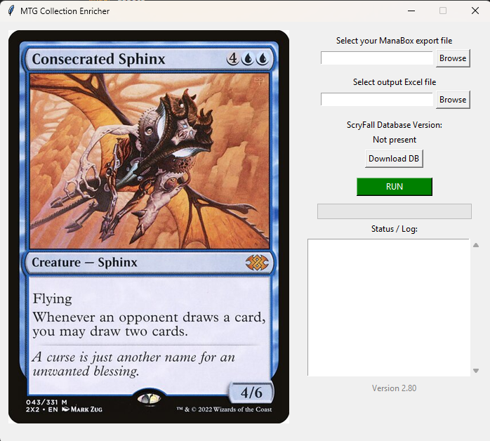
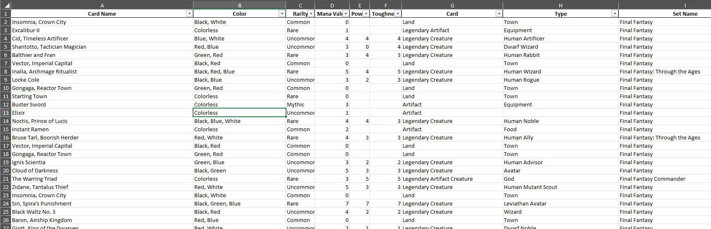

# Download the latest mtgscan.exe

# MTG Collection Enricher GUI

A Windows desktop tool that enriches a ManaBox export with full Scryfall data and
creates a filter-ready Excel workbook (one sheet, drop-down filters on every
column).  
Features include:

* Random MTG card image that cycles every 10 s  
* Bulk Scryfall data auto-download / update (~500 MB, cached locally)  
* Split **Card / Type** columns, **Set Name**, auto-width columns  
* Status log with progress bar and **Version 2.75** label  
* “Choose save location” dialog each run; log shows full output path  
* One-click EXE build via PyInstaller

| Column order |
|--------------|
| Card Name • Color • Rarity • Mana Value • **Card** • **Type** • Set Name • Foil • Quantity • Collector Number • ManaBox ID • Scryfall ID |

## UI preview

## .xlsx Output Example

## 🖥️ Quick Start (from source)
<pre><code>git clone https://github.com/AngryMunky/mtg-collection-enricher.git
cd mtg-collection-enricher
pip install -r requirements.txt
python mtgscan.py</code></pre>
---
## 📒 Patch Notes
### v2.80.5
- **Download EXE** badge added to README  
- Switched to actions/upload-artifact@v4 in CI  
- Granted GitHub Action permission to create Releases  

### v2.80.1–v2.80.4
- UI refinements: separate input/output browse fields  
- DB controls: display version, “Download” / “Update” buttons, progress & ETA logs  
- Power/Toughness split columns, numeric formatting  
- EXE icon support & PyInstaller one-file build  

### v2.75
- Initial GitHub release  
- Random card image cycling  
- Bulk Scryfall DB auto-download/update  
- Split type columns, set name, autosizing  
- Status log + progress bar
